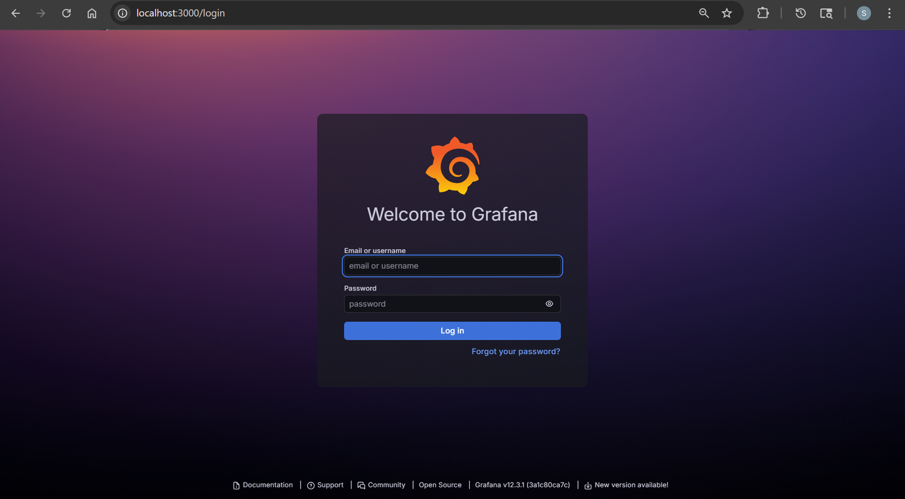

- Deploy a public helm chart repo
- ref:
  - repo: https://grafana.github.io/helm-charts/

```sh
kubectl apply -f grafana/grafana-app.yaml
# application.argoproj.io/grafana created

argocd app list
# NAME            CLUSTER                         NAMESPACE  PROJECT  STATUS     HEALTH   SYNCPOLICY  CONDITIONS  REPO                                   PATH  TARGET
# argocd/grafana  https://kubernetes.default.svc  grafana    default  OutOfSync  Missing  Manual      <none>      https://grafana.github.io/helm-charts        10.5.15

argocd app sync argocd/grafana
# NAME                      READY   STATUS    RESTARTS   AGE
# grafana-c9ccbfdf4-xs8zm   1/1     Running   0          2m1s

kubectl get application -n argocd
# NAME      SYNC STATUS   HEALTH STATUS
# grafana   Synced        Healthy

kubectl get svc -n grafana
# NAME      TYPE        CLUSTER-IP      EXTERNAL-IP   PORT(S)   AGE
# grafana   ClusterIP   10.106.35.247   <none>        80/TCP    93s

kubectl port-forward svc/grafana -n grafana 3000:80
```


