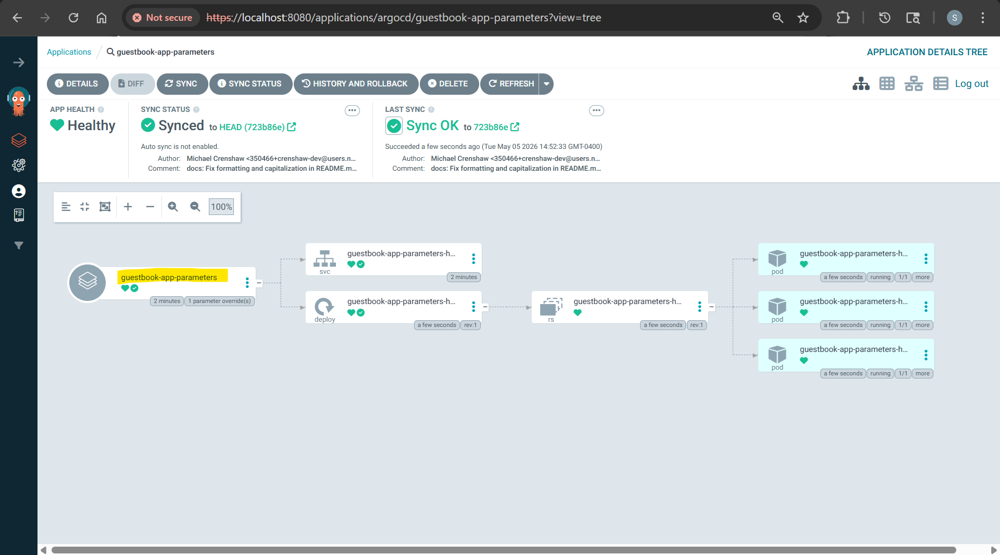

```sh
kubectl apply -f guestbook-app/guestbook-app-parameters.yaml
# application.argoproj.io/guestbook-app-parameters created

argocd app list
# NAME                             CLUSTER                         NAMESPACE  PROJECT  STATUS     HEALTH   SYNCPOLICY  CONDITIONS  REPO                                                        PATH            TARGET
# argocd/guestbook-app-parameters  https://kubernetes.default.svc  default    default  OutOfSync  Missing  Manual      <none>      https://github.com/simonangel-fong/argocd-example-apps.git  helm-guestbook  HEAD

argocd app sync argocd/guestbook-app-parameters

kubectl get po
# NAME                                                      READY   STATUS    RESTARTS   AGE
# guestbook-app-parameters-helm-guestbook-78d98bb7b-4q5w5   1/1     Running   0          7s
# guestbook-app-parameters-helm-guestbook-78d98bb7b-s9mmm   1/1     Running   0          7s
# guestbook-app-parameters-helm-guestbook-78d98bb7b-sm8jx   1/1     Running   0          7s
```


