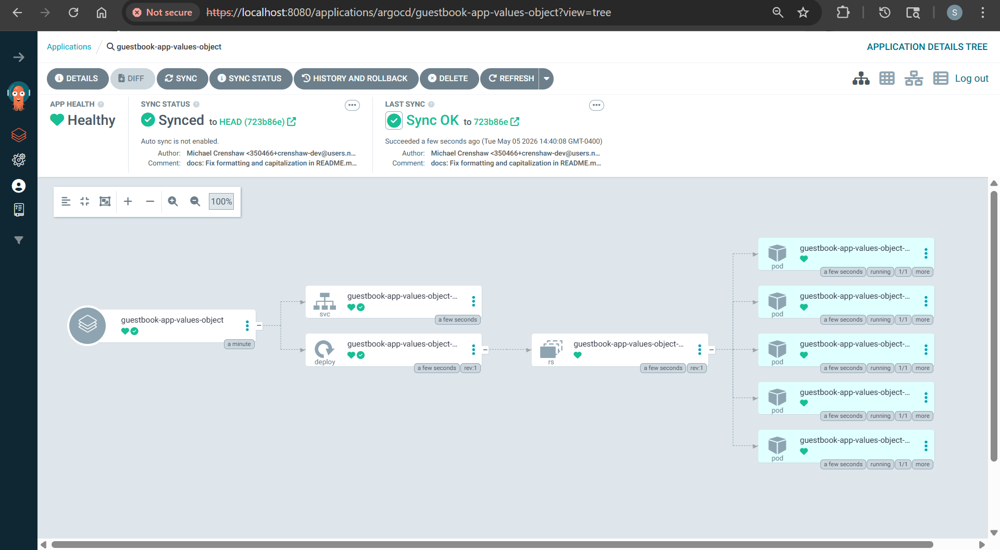

```sh
kubectl apply -f guestbook-app/guestbook-app-values-object.yaml
# application.argoproj.io/guestbook-app-values-object created

argocd app list
# NAME                                CLUSTER                         NAMESPACE  PROJECT  STATUS     HEALTH   SYNCPOLICY  CONDITIONS  REPO                                                        PATH            TARGET
# argocd/guestbook-app-values-object  https://kubernetes.default.svc  default    default  OutOfSync  Missing  Manual      <none>      https://github.com/simonangel-fong/argocd-example-apps.git  helm-guestbook  HEAD

argocd app sync argocd/guestbook-app-values-object

kubectl get po
# NAME                                                          READY   STATUS    RESTARTS   AGE
# guestbook-app-values-object-helm-guestbook-74f99fcdbd-25vtx   1/1     Running   0          6s
# guestbook-app-values-object-helm-guestbook-74f99fcdbd-2rjk2   1/1     Running   0          6s
# guestbook-app-values-object-helm-guestbook-74f99fcdbd-hwr2m   1/1     Running   0          6s
# guestbook-app-values-object-helm-guestbook-74f99fcdbd-j4llt   1/1     Running   0          6s
# guestbook-app-values-object-helm-guestbook-74f99fcdbd-zvzjj   1/1     Running   0          6s
```


