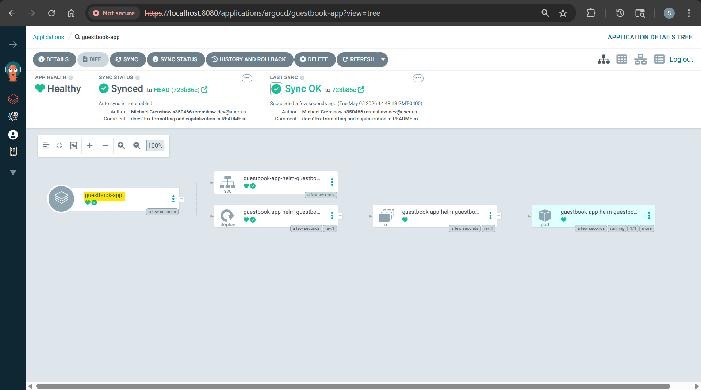

```sh
kubectl apply -f guestbook-app/guestbook-app.yaml
# application.argoproj.io/guestbook-app created

argocd app list
# NAME                  CLUSTER                         NAMESPACE  PROJECT  STATUS     HEALTH   SYNCPOLICY  CONDITIONS  REPO                                                        PATH            TARGET
# argocd/guestbook-app  https://kubernetes.default.svc  default    default  OutOfSync  Missing  Manual      <none>      https://github.com/simonangel-fong/argocd-example-apps.git  helm-guestbook  HEAD

argocd app sync argocd/guestbook-app 

kubectl get application -n argocd
# NAME            SYNC STATUS   HEALTH STATUS
# guestbook-app   Synced        Healthy
```

